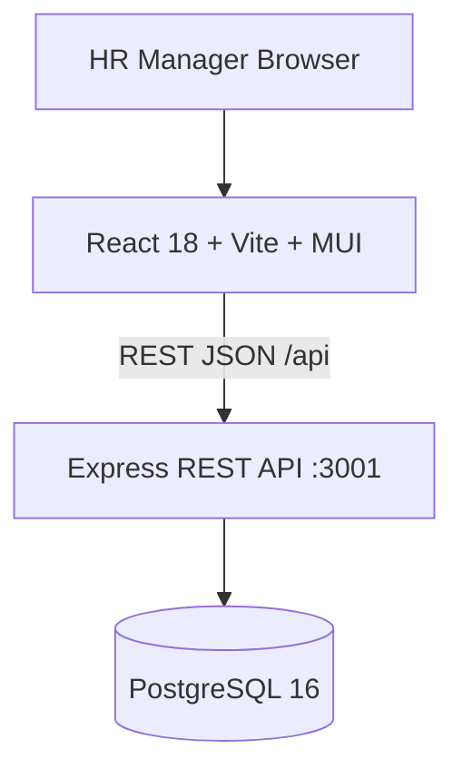
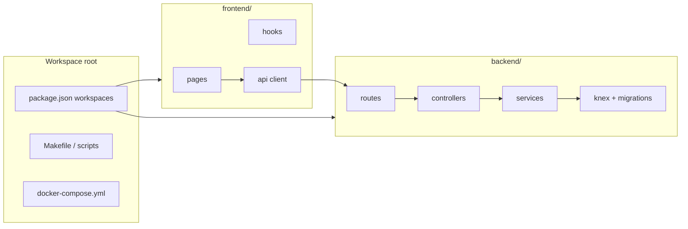
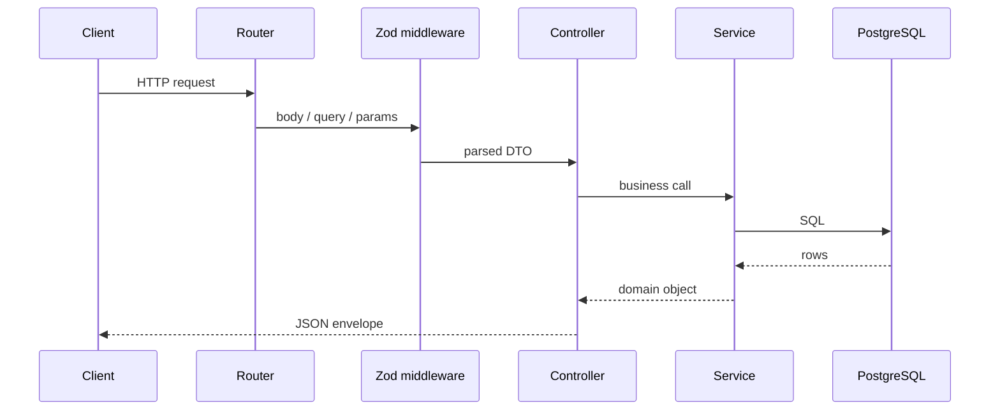
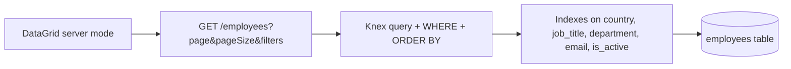
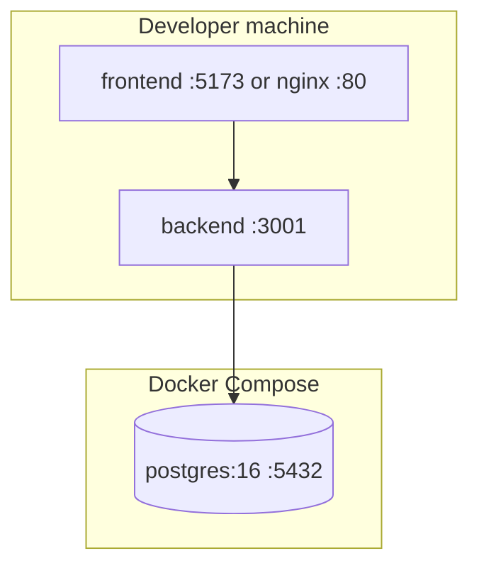

# Salary Management System — Planning & Design Notes

This document captures how the system was planned, built, and operated. It is intended for reviewers, maintainers, and anyone extending the project.

**Related docs**
- [README.md](../README.md) — setup, run, test, deploy
- [DEMO.md](./DEMO.md) — 60–90 second demo script

---

## 1. Project intent

| Item | Decision |
|------|----------|
| **Primary user** | HR Manager |
| **Scale target** | 10,000 employees |
| **Core workflows** | Employee CRUD; salary insights by country and job title |
| **Quality bar** | Layered backend, typed API, fast deterministic tests, Docker-ready PostgreSQL |

---

## 2. Instructions (how to work with this repo)

### 2.1 Prerequisites

- Node.js 20+
- npm 10+
- Docker Desktop (PostgreSQL)
- GNU Make (optional on Windows; PowerShell scripts provided)

### 2.2 First-time setup

**Recommended (Windows PowerShell)**

```powershell
cd C:\Users\pmore\Projects\salary-management-system-workspace
.\scripts\setup.ps1    # install, Docker DB, migrate, seed 10k
.\scripts\start.ps1    # API :3001 + UI :5173
```

**Linux / macOS / WSL 2**

```bash
make install
make setup
make start
```

**If WSL 1 breaks `make` (getcwd / npm errors)**

```bash
bash scripts/install.sh
bash scripts/setup.sh
bash scripts/start.sh
```

### 2.3 Day-to-day development

| Task | Command |
|------|---------|
| Start API + UI | `npm start` or `make start` |
| Backend only | `npm run dev -w backend` |
| Frontend only | `npm run dev -w frontend` |
| Run all tests | `npm test` |
| Backend tests | `npm run test:backend` |
| Frontend tests | `npm run test:frontend` |
| Reseed DB | `npm run seed -w backend -- --reset` |
| Apply migrations | `npm run migrate` |

### 2.4 Environment variables

| Variable | Purpose |
|----------|---------|
| `DATABASE_URL` | PostgreSQL connection (app + seed) |
| `DATABASE_URL_TEST` | Test database (Vitest) |
| `PORT` | API port (default `3001`) |
| `VITE_API_URL` | Frontend → API base (default `http://localhost:3001/api`) |
| `CORS_ORIGIN` | Allowed browser origin (default `http://localhost:5173`) |
| `NODE_ENV` | `development` / `test` / `production` |

Copy from [`.env.example`](../.env.example) and [backend/.env.example`](../backend/.env.example).

### 2.5 Code layout conventions

**Backend** — `routes → controllers → services → db`

- Validation: Zod in `validators/`, applied via `middleware/validate.ts`
- Mapping: `mappers/employeeMapper.ts`
- Constants: `constants/employee.ts`
- Errors: `AppError` + `mapDatabaseError` in middleware

**Frontend** — feature-oriented UI

- Pages: thin orchestration (`pages/`)
- Hooks: data + side effects (`hooks/`)
- API: `api/employeesApi.ts`, `api/insightsApi.ts`
- Validation: `validation/employeeSchema.ts` (aligned with backend rules)

---

## 3. Planning & design notes

### 3.1 Phased delivery (implementation order)

1. PostgreSQL schema + Knex migrations + indexes  
2. Employee REST CRUD + Zod validation + integration tests  
3. Insights endpoints (SQL `GROUP BY` only) + tests  
4. Seed script (10k rows, bulk batches) + name files  
5. React + MUI UI: Employees (server-side DataGrid)  
6. Insights page (summary, country table, country+title drill-down)  
7. Docker Compose + root workspace scripts + README  
8. Refactor pass: mappers, hooks, shared constants, error mapping  

### 3.2 Domain model (employee)

| Field | Storage | Notes |
|-------|---------|--------|
| `id` | UUID | `gen_random_uuid()` |
| `employeeNumber` | `EMP-00001` … | Unique, human-readable |
| `fullName` | string | Seed: random first + last from txt files |
| `email` | string | Unique |
| `jobTitle`, `department`, `country`, `currency` | string / enum | Filter + group dimensions |
| `salary` | `DECIMAL(12,2)` | API returns number |
| `employmentType` | enum | `FULL_TIME`, `PART_TIME`, `CONTRACT` |
| `startDate` | date | Not in the future (validated) |
| `isActive` | boolean | Soft delete: `DELETE` sets `false` |

### 3.3 API design principles

- **Envelope:** `{ data }` or `{ data, meta }` for lists; `{ error: { message, code } }` on failure  
- **Pagination:** Server-side only; default `pageSize=25`, max `100`  
- **Insights:** Never load 10k rows into Node; aggregations in PostgreSQL  
- **Id params:** UUID validated before DB access (400 vs 500)  

### 3.4 UI design principles

- HR-first labels and currency formatting  
- No full client-side dataset (10k rows)  
- Debounced search (300ms)  
- Confirm + loading state on deactivate  
- Insights: summary cards → drill-down → country distribution table  

---

## 4. Architecture diagrams

### 4.1 System context



### 4.2 Monorepo layout



### 4.3 Backend request flow



### 4.4 Employee list (scale path)



### 4.5 Insights aggregation path


### 4.6 Deployment (local / Docker)



---

## 5. Prompts & instructions used with AI tools

These are the effective prompts and constraints that shaped the build (paraphrased from the agent session). Reuse or adapt them for extensions.

### 5.1 Master build prompt (full stack)

Use this as a single agent instruction to scaffold or extend the project:

```text
Build a minimal but production-usable salary management tool for 10,000 employees.
Primary user: HR Manager. Scaffold from scratch.

Stack (fixed):
- Frontend: React 18 + Vite + TypeScript + MUI + @mui/x-data-grid (server pagination)
- Backend: Node.js + Express + TypeScript
- Database: PostgreSQL
- API: REST JSON
- ORM: Knex + migrations; validation: Zod; Docker Compose for PostgreSQL

Requirements:
- Employee CRUD via UI; soft delete (isActive=false)
- Insights: min/max/avg/median/total payroll by country; avg/min/max by country+job title; summary
- Seed 10,000 employees from first_names.txt + last_names.txt; bulk insert < 30s
- Server-side pagination (never load 10k in browser)
- Backend + frontend tests: fast, deterministic
- README, DEMO.md, docker-compose

Implement in order: DB → CRUD + tests → insights + tests → seed → UI employees → UI insights → Docker/docs.
```

### 5.2 Stack-specific prompt (used for this repo)

```text
Frontend: React (Vite), MUI.
Backend: Node.js Express.
Database: PostgreSQL.
API: REST.
Do not use Next.js, SQLite, or stack substitution.
```

### 5.3 Refactor prompt

```text
Go through both repositories and refactor the code:
- Layered backend with mappers, constants, DB error mapping, UUID validation
- Frontend: split API modules, hooks (useEmployees, useCountryJobTitleFilters), feature components
- Align form validation with backend; fix MUI icon imports (named imports from @mui/icons-material)
- Keep tests green
```

### 5.4 Agent guidelines applied

- Clean Code / single responsibility per module  
- No loading 10k rows in memory for insights  
- Tests before claiming done; run `npm test` on both packages  
- Windows + WSL: provide PowerShell scripts when `make` fails on WSL 1  

### 5.5 Suggested prompts for future work

| Goal | Prompt snippet |
|------|----------------|
| Shared validation package | "Add `packages/shared` with Zod schemas consumed by backend and frontend; keep enums in one file." |
| Auth | "Add JWT auth for HR role; protect /api/employees and /api/insights; no breaking existing tests." |
| CSV export | "Add GET /employees/export?filters with streaming CSV; cap row count server-side." |
| Currency-aware insights | "Group insights by country+currency before aggregating; update Insights UI." |

---

## 6. Trade-off explanations

### 6.1 Stack & tooling

| Choice | Alternatives considered | Why this choice | Trade-off |
|--------|-------------------------|-----------------|-----------|
| **PostgreSQL** | SQLite | Production-like, concurrent writes, strong aggregations | Requires Docker locally |
| **Knex** | Prisma | Simple migrations + raw SQL for insights; low magic | Less auto-generated client types |
| **Express** | Fastify, NestJS | Fast to scaffold, well understood | Less structure than Nest |
| **React + Vite** | Next.js | SPA fits internal HR tool; simple deploy as static files | No SSR/SEO (not needed) |
| **MUI v5** | MUI v6, Tailwind | Stable with React 18; DataGrid v7 compatibility | Heavier bundle |
| **Vitest** | Jest | Fast, ESM-friendly, same config as Vite | Smaller ecosystem than Jest |
| **Monorepo npm workspaces** | Nx, Turborepo | One `npm install`, shared scripts | No advanced task graph |

### 6.2 Data & API

| Choice | Why | Trade-off |
|--------|-----|-----------|
| **Soft delete** | Preserve history for HR/audit | List defaults to active; need `includeInactive` for full view |
| **DECIMAL(12,2) for salary** | Exact money in DB | Cross-currency insights are indicative only (see below) |
| **SQL aggregations in DB** | O(1) memory vs loading 10k rows | More complex queries; tied to PostgreSQL |
| **Separate validation (BE/FE)** | No shared package yet in v1 | Duplication risk; mitigated by mirroring rules in `employeeSchema.ts` |
| **UUID path validation** | Clear 400 before DB | Stricter than accepting any string id |

### 6.3 UI/UX

| Choice | Why | Trade-off |
|--------|-----|-----------|
| **Server-side DataGrid** | Only ~25 rows per request | Extra round-trip on page/sort/filter change |
| **Debounced search 300ms** | Fewer API calls while typing | Slight delay before results update |
| **Hooks vs React Query** | Fewer dependencies in v1 | Manual loading/error state |
| **IconButtons in grid** | Dense layout for HR tables | Less obvious than text buttons for new users |

### 6.4 Operations

| Choice | Why | Trade-off |
|--------|-----|-----------|
| **Makefile + PowerShell + bash scripts** | Cross-platform friction on WSL 1 | Three ways to do the same thing; documented in README |
| **Seed 10k on demand** | Demo/review requirement | Large DB footprint locally |

---

## 7. Performance considerations

### 7.1 Database

| Technique | Implementation |
|-----------|----------------|
| **Indexes** | `country`, `job_title`, `department`, `email`, `employee_number`, `is_active`, `full_name` |
| **Pagination** | `LIMIT` / `OFFSET` on filtered queries (default 25, max 100) |
| **Bulk seed** | Batches of 1,000 rows per transaction; target &lt; 30s for 10k |
| **Insights** | `GROUP BY` + aggregates in SQL; median via `percentile_cont(0.5)` |
| **Connection pool** | Knex pool min 2, max 10 |

**Expected scale (local benchmarks)**

- Seed 10,000 employees: ~1–3 seconds (hardware dependent)  
- Paginated list: &lt; 100ms typical with indexes  
- Insights by country: single scan + group; acceptable to ~100k rows with indexes  

**Future bottlenecks**

- `OFFSET` pagination slows on very deep pages (e.g. page 400); consider keyset pagination if needed  
- Global search `%name%` uses `ILIKE`; consider `pg_trgm` index if search latency grows  

### 7.2 Backend API

- No in-memory full-table loads for insights  
- Clone query for count + page to avoid N+1  
- Map DB errors without retry storms (409 for unique violations)  

### 7.3 Frontend

| Technique | Purpose |
|-----------|---------|
| Server pagination/sorting | Constant DOM size |
| Debounced search | Reduces API QPS |
| Code splitting (future) | Main bundle ~1.3MB — optional `import()` per route |
| MUI DataGrid server mode | Renders only current page |

### 7.4 Testing performance

- Backend: real PostgreSQL test DB; file-level serial runs; target &lt; 15s total  
- Frontend: Vitest + jsdom; DataGrid mocked in page tests; `maxWorkers: 1` on slow CI  

### 7.5 Docker / runtime

- PostgreSQL 16 with volume for persistent data  
- Health check: `GET /health` runs `SELECT 1`  
- Full stack profile: `docker compose --profile full up --build`  

---

## 8. Security & reliability (brief)

| Area | Current state | Recommended next step |
|------|---------------|---------------------|
| Authentication | None (internal demo) | JWT or SSO for production |
| Authorization | None | Role-based access (HR admin) |
| Secrets | `.env` gitignored | Use secret manager in deploy |
| Input validation | Zod on body/query/params | Keep shared schema package in sync |
| Rate limiting | None | Add at reverse proxy or Express middleware |

---

## 9. Testing strategy

| Layer | Tool | Scope |
|-------|------|--------|
| Backend API | Vitest + supertest | CRUD, validation, insights math, pagination meta |
| Frontend unit | Vitest + RTL | Dialog validation, page smoke with mocked API |
| E2E | Not in v1 | Optional Playwright against docker compose |

---

## 10. Revision history

| Date | Change |
|------|--------|
| 2026-05-22 | Initial system build: CRUD, insights, seed, Docker, README |
| 2026-05-22 | Root workspace: `make start`, npm workspaces, PowerShell/bash scripts |
| 2026-05-22 | Refactor: mappers, hooks, split API, DB error mapping, validation alignment |
| 2026-05-22 | Added this planning & design document |

---

## 11. Review checklist (for assessors)

- [ ] `make setup` or `.\scripts\setup.ps1` completes and seeds 10k employees  
- [ ] `npm start` — UI loads, Employees list paginates  
- [ ] CRUD: add, edit salary, deactivate  
- [ ] Insights: country table + country/job title metrics  
- [ ] `npm run test:backend` — 9 tests pass  
- [ ] `npm run build` — backend + frontend compile  
- [ ] Read trade-offs §6 and performance §7 for design rationale  
